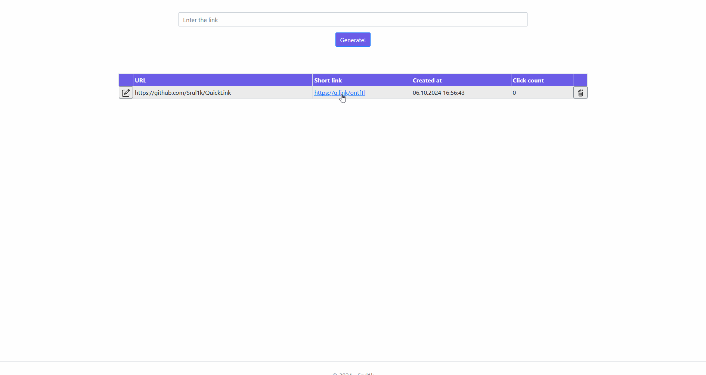

# 🔗QuickLink
 

This is a simple application for shortening long links and counting the number of clicks on them.

<details>
<summary>▶️ How to run</summary>
1. Open Command Prompt and move to the working directory:
```cmd
cd src
```

2. Run the command for docker compose: [(more info)](https://docs.docker.com/compose/gettingstarted/)
```cmd
docker-compose up -d
```

3. Run the command to see which port the application is using:
```cmd
docker-compose ps
```


4. Open the link in the browser (example for output from above):
```
https://localhost:55226/
```

5. Enjoy! 🎉
</details>

<details>
<summary>🎞️ Presentation</summary>


</details>
